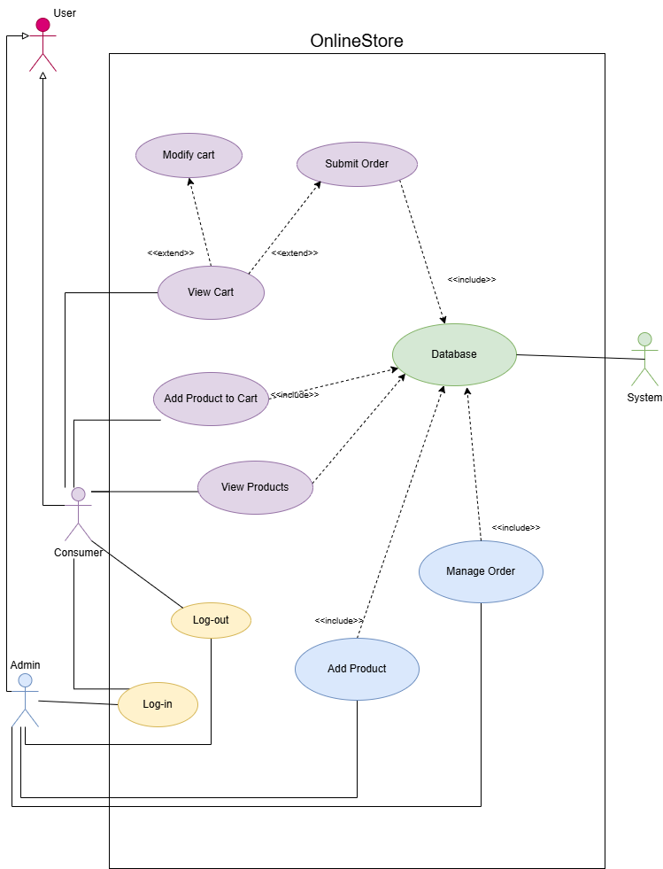
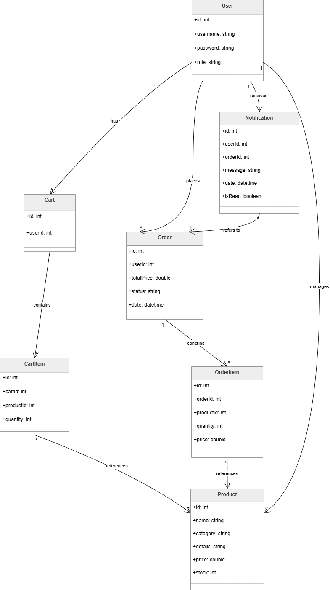

# Actors

- **Consumer** – can view products, add products to cart, modify cart and submit orders  
- **Admin** – can add products to stock and view customer orders  
- **System** – handles internal operations such as notifications, order processing and stock updates  

# Use Case Diagram

# Conceptual Model Diagram

## the best(V2): 
.png)

## V1

