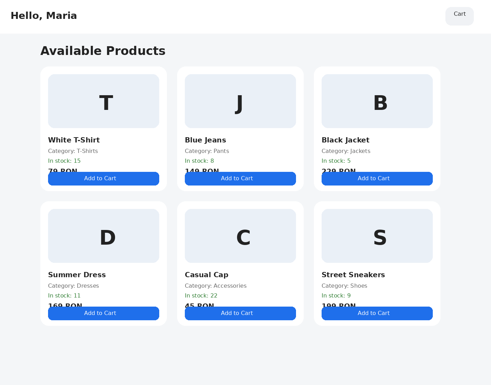
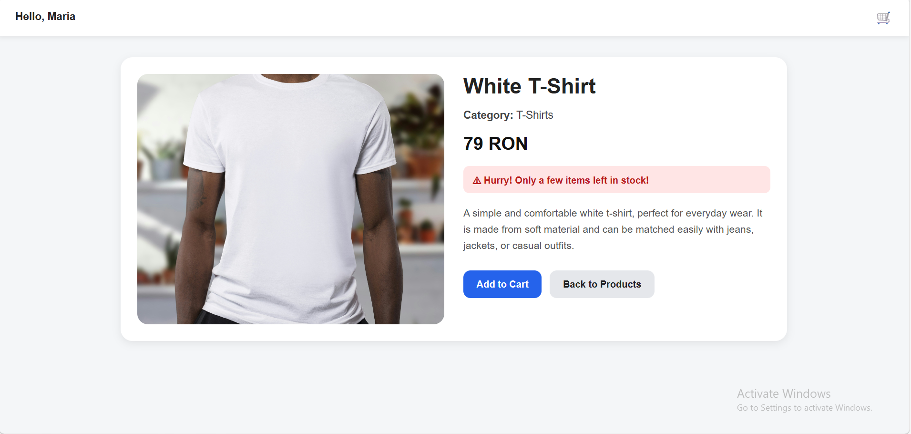
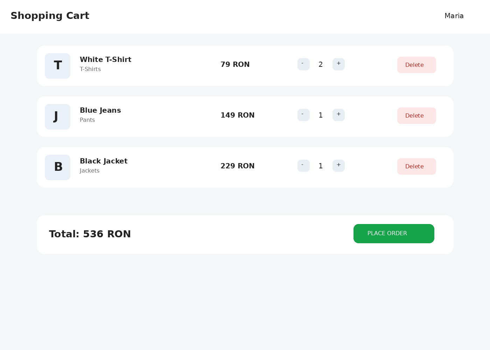
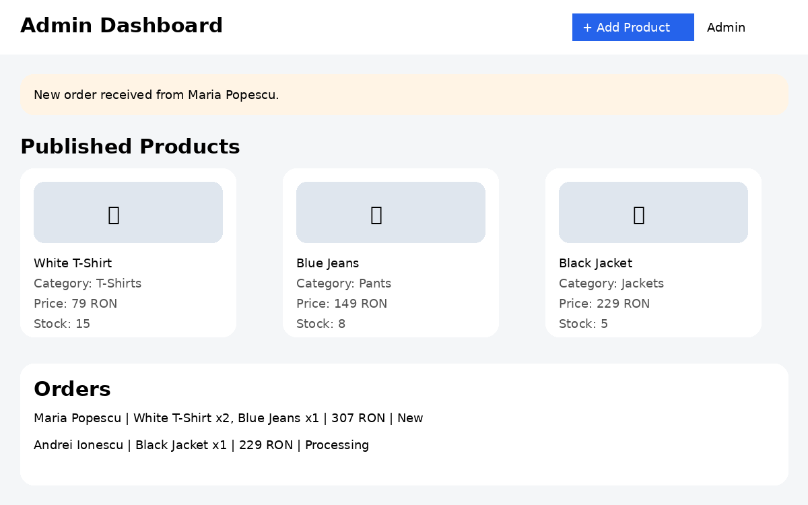

# View

## Consumer

### Home Page

- The username is displayed in the top-left corner  
- All available products are displayed in the center  
- Each product includes name, category, price, and an "Add to Cart" button  
- The cart icon is displayed in the top-right corner
  
 ---
 
### Product Page

 ---
 
### Cart Page

- All products added to the cart are displayed  
- Each product has buttons to modify quantity (+ / -)  
- There is an option to remove a product from the cart  
- The total price of the order is displayed at the bottom  
- A "Place Order" button is available (stock is updated after order)  

## Admin

### Admin Page

- The admin can view all published products  
- The admin can add new products using the "Add Product" button  
- The admin receives notifications for new orders  
- The admin can see who placed the order and what products were ordered  
